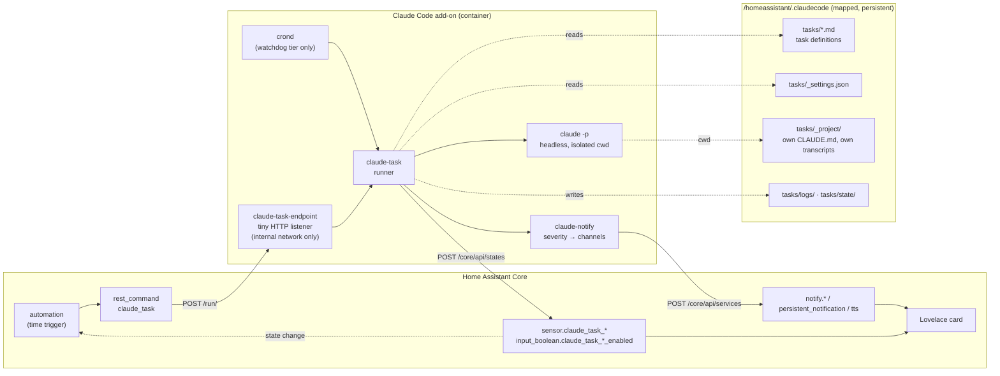
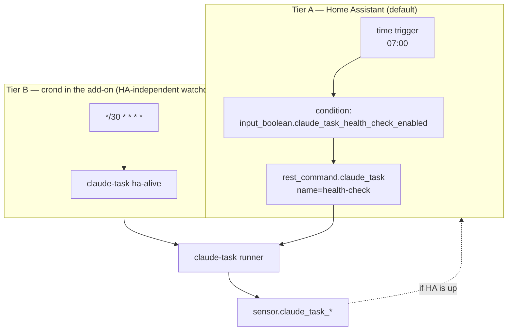

# Claude Tasks for Home Assistant

> A design for scheduled, unattended Claude runs inside the Claude Code add-on — health checks, reports, and anything else worth doing while nobody is watching — that notify through Home Assistant and stay out of the interactive session's way.

_design v2 · 2026-08-17 · **status: proposal, nothing built** · targets `main` at con.6 (#18, #24, #25 merged) · rendered copy of v1: https://claude.ai/code/artifact/e3c91221-2f21-4646-ba3c-032eb1cae27f_

> **v2 changes** (after #24/#25 landed and a re-review against them): endpoint and crond now hook into `claudecode-start` and its `on_stop`; the watchdog-based `binary_sensor` and `GET /health`-as-watchdog are removed (a Supervisor watchdog restart kills the live session — see #25); the nesting guard names the real environment markers; the endpoint hostname is the verified `<slug>` form; every PR bumps the version; §13 lists what was verified vs. still assumed.


## Summary

Today the add-on runs Claude in exactly one shape: an interactive terminal session, optionally kept alive by tmux and reachable through Remote Control. Anything periodic — a nightly health check, a morning energy report — has to be a fixed script that Home Assistant calls, which means the one thing Claude is good at (looking at the evidence and forming a judgement) is unavailable to the schedule.

This design adds a second shape: a **task**. A task is a Markdown file that Claude itself can author, run headlessly by a small runner that isolates it from the interactive session, constrains its tools, times it out, and turns its result into a Home Assistant entity plus a notification chosen by severity. Home Assistant owns the schedule; the add-on owns execution; a person owns any action that follows.

Five things are settled by the decisions already taken with the user, and the rest of the document builds on them:

- Home Assistant triggers tasks over HTTP into the add-on (not a file queue).
- The Claude-driven energy report *replaces* the existing Python one.
- Scheduled tasks are **read-only**: they observe and propose; acting requires a human tap.
- The default model is Opus.
- Tasks live in *this* add-on, not a second one — one login, one credential store, one thing to keep alive.


## 1 · Problem

The current precedent on the reference install is `automation.schedule_daily_energy_report`: at 07:30 HA calls `shell_command.daily_energy_report` (a Python script), captures its stdout, and pushes it to two phones. It works, and it shows the ceiling:

- **The scheduled thing cannot judge.** A script aggregates; it cannot notice that today's number is odd *because* the pool pump ran at night, or that a 47 kWh solar day was weather rather than hardware. "Notify me of issues" is exactly the part a script cannot do.
- **The output protocol is stdout regex.** HA parses `OCCDATA true=…` and `err=…` out of prose with Jinja. Every new task means new Python, a new automation, and new regex.
- **Nothing surfaces in HA as state.** There is no entity that says "the last health check was at 07:00 and found two warnings", so no dashboard, no history, no kill switch.

The gap is not scheduling — HA schedules well. The gap is that the scheduled thing should be Claude, with a contract HA can act on.


## 2 · Verified facts this design rests on

Everything below was checked on the reference install (HA OS 18.2, add-on 1.2.65-con.4 → con.6 during the day, Claude Code 2.1.233) on 2026-08-17. Where a fact changes the design, it says so. Facts marked *(assumed)* were **not** verified and are called out again in §13.

| Fact | Evidence | Consequence |
|---|---|---|
| Headless runs work in the container and return a structured envelope | `claude -p … --output-format json` returned `PONG` in 1.5 s; envelope carries `is_error`, `permission_denials`, `total_cost_usd`, `num_turns`, `stop_reason`, `session_id` | The runner judges a run from the envelope, not from prose |
| **A headless run poisons `--continue`** | The probe wrote its own transcript into the same project directory; `--continue` resumes the most-recently-modified transcript | **Tasks must run in a separate project directory.** Otherwise a task at 03:00 followed by a restart at 03:05 resumes *the task*, not the user's session |
| A task can create HA entities with no YAML and no restart | `POST /core/api/states/sensor.claude_task_probe` → 201; `DELETE` → 200 | UI state per task appears dynamically |
| A task can call any HA service through the Supervisor proxy | `POST /core/api/services/persistent_notification/create` → 200, no MCP involved | The notifier needs no MCP server and works when MCP is disabled |
| `persistent_notification` and `notify.notify` exist on every HA | Present on the reference install; both are core | Two channels are guaranteed portable |
| `mobile_app_*` targets are discoverable at runtime | `GET /core/api/services` lists `notify.mobile_app_pixel_8a`, `…_pixel_9_pro_xl` | The notifier enumerates phones; nothing is hard-coded to this house |
| ttyd cannot host a second HTTP route | `ttyd --help`: index, base-path, auth — no route table | The trigger endpoint is its own small listener |
| Add-ons resolve by `<slug-with-dashes>` on the hassio network | From inside this add-on, `http://d5369777-music-assistant:8095/` → 200; the bare short name does not resolve | HA's `rest_command` targets `http://d7e97e69-claudecode:7682` (slug prefix is per-install; the shipped package templates it) |
| The add-on's AppArmor profile already grants `network` | `apparmor.txt` line 18 | A second listener needs no profile change |
| Startup is one function per step in `claudecode-start`, ttyd runs as a *child* (`TTYD_PID`, `wait`), and `on_stop` handles SIGTERM with a 30s grace (`timeout: 30`) | #24, #25 on `main` | The endpoint and crond are started by new functions in that script and **stopped by `on_stop`** — they must not outlive ttyd or block the grace period |
| Real interactive-session env markers | This session exports `CLAUDECODE`, `CLAUDE_CODE_SESSION_ID`, `CLAUDE_CODE_ENTRYPOINT`, `CLAUDE_PID` | The nesting guard tests these, not an invented name |
| `crond` exists but is not running; `/etc/crontabs` is on the overlay | Alpine busybox crond present; overlay is wiped on rebuild | If crond is used, the add-on starts it and the crontab lives on the mapped volume |
| Session-scoped cron in Claude Code is not durable | `CronCreate`: in-memory, dies with the session, 7-day cap, fires only when the REPL is idle | Not usable for this |
| claude.ai routines cannot reach the LAN | They run in Anthropic's cloud | Fine for repo/web work; not for HA |
| `CLAUDE.addon.md` is regenerated into `~/.claude/CLAUDE.md` at every boot | Dockerfile `cp /usr/share/claudecode/CLAUDE.addon.md $PERSIST_DIR/CLAUDE.md` | Telling the interactive session about tasks belongs in the *shipped* file, upstream — not in the user's own file |


## 3 · Principles

1. **Home Assistant schedules; the add-on executes; a person acts.** HA gives durable schedules, traces, notify and UI for free and is where the user already reasons about automation. The add-on has Claude, the tools, and the credentials. Neither reaches into the other's job.
2. **The scheduled thing is Claude, with a contract.** A task returns a small JSON result HA can branch on. No stdout regex.
3. **Read-only by construction, not by prompt.** Tools are allow-listed per task and the runner refuses anything else. A crafted log line can make a task *say* something wrong; it cannot make it *do* anything.
4. **Isolated from the interactive session by construction.** Separate project directory, separate settings file, separate transcripts. Whatever a task does, `--continue` in the terminal still resumes the human's conversation.
5. **Fail loud, in-band.** Every failure a task can have — timeout, tool denial, model error, bad definition — becomes visible in HA as a state, the same way an ordinary finding does. A watchdog that dies silently is worse than none.
6. **Portable first, instance-specific by configuration.** Anything that names a device, a room, or a speaker is data in a task file, never code in the add-on.


## 4 · Architecture



_Home Assistant triggers a task over HTTP into the add-on. The runner reads the task definition from the persistent volume, runs Claude headlessly in an isolated project directory, and pushes the result back into HA as an entity and a notification. crond exists only for the checks HA cannot run on itself._


### 4.1 The runner — `claude-task`

One executable, `/usr/local/bin/claude-task [--dry-run] [--json]`, invoked identically by the endpoint, by crond, and by a human at the terminal. Everything else composes on it.

**Layout on the persistent volume**

```
/homeassistant/.claudecode/tasks/
├── health-check.md          task definition (frontmatter + prompt)
├── energy-report.md
├── _settings.json           the ONLY settings file tasks use — minimal
├── _project/                isolated cwd for every task run
│   ├── CLAUDE.md            "you are a scheduled task; here is the contract"
│   └── .claude/projects/…   task transcripts land HERE, never in the user's project
├── logs/<name>.jsonl        one line per run: envelope + timings + result
└── state/<name>.json        last result, for diffing and re-nag decisions
    <name>.lock              flock; PID inside so a stale lock is detectable
```

```
---
name: health-check
description: Daily check of the HA instance; reports anything a human should look at.
model: claude-opus-5
timeout: 600
max_cost_usd: 1.50
tools:
  - Bash(ha core check)
  - Bash(ha core logs:*)
  - Bash(ha supervisor info)
  - Bash(ha resolution info)
  - Read(/homeassistant/**)
  - Grep(/homeassistant/**)
  - mcp__homeassistant__get_error_log
  - mcp__homeassistant__list_automations
notify:
  critical: [mobile_critical, persistent]
  warning:  [mobile, persistent]
  info:     [persistent]
  ok:       [state_only]
---
You are the daily health check for this Home Assistant instance. …
End your response with exactly one line of JSON matching the result contract.
```

The frontmatter is the whole security boundary: `tools` becomes `--allowedTools`, and nothing not listed can run. The user's interactive allow-list is never consulted.

**What the runner does, in order.** Each step is chosen so that a failure at that step still leaves a visible trace.

1. **Refuse to run inside an interactive session.** If `CLAUDECODE` or `CLAUDE_CODE_SESSION_ID` is set in the environment (both are, inside a running Claude Code session — verified), exit with a clear message. A task started from the terminal *shell* by hand is fine (those variables are not set there); a task nested inside the interactive Claude is not. The runner also unsets every `CLAUDE_*` variable before spawning `claude -p`, so a task never inherits the interactive session's identity.
2. **Lock.** `flock` on `state/.lock`, non-blocking. If held, check the PID inside; if that PID is dead, the lock is stale — break it and log `stale_lock_broken`. If alive, exit with status `skipped` and publish that as the entity state, so an over-eager schedule shows up rather than silently piling up.
3. **Load and validate the definition.** Missing `tools`, unknown keys, a `timeout` above the hard ceiling, a model that isn't allowed — all fail *before* any tokens are spent, with the reason in the entity.
4. **Assemble the prompt.** Data the task must look at is gathered by the task's own tools during the run, not pre-injected — so the prompt is the definition body plus the result-contract instruction. Where a task *does* take input from the trigger (e.g. "which day to report on"), it arrives as a typed field from the endpoint, is validated, and is placed *before* the instructions with an explicit "the following is data" frame.
5. **Run.** `cd _project/ && timeout claude -p "$PROMPT" --output-format json --permission-mode default --allowedTools --settings ../_settings.json --add-dir /homeassistant --model `. Note `--permission-mode default`, not `bypassPermissions`: anything outside the allow-list is *denied*, and a denial is a finding.
6. **Judge the envelope.** `is_error` → status `error`, headline from the envelope.
7. `permission_denials` non-empty → status `error`, headline "task definition needs tool X" — a denial means the tools list is wrong, and that is a bug in the file, not a runtime condition to swallow.
8. `total_cost_usd > max_cost_usd` → recorded and surfaced as `warning` even if the task's own verdict was `ok`.
9. Otherwise, parse the final line of `result` as the contract (§4.2). Unparseable → `error` with the raw tail attached.
10. **Persist.** Append to `logs/.jsonl`; write `state/.json` last, so a crash between steps leaves the previous known-good state.
11. **Publish.** `POST /core/api/states/sensor.claude_task_` with state = status and attributes = headline, detail, actions, last_run, duration_s, cost_usd, run_count, session_id. This is what the dashboard, the automations, and history all read.
12. **Notify.** Hand the result to `claude-notify` with the task's severity map. The runner never talks to a channel itself.
13. **Exit.** Non-zero only if the *runner* failed. A task that found a critical problem is a *successful run* — exit 0 — because the finding is the product.


### 4.2 The result contract

The task's last line of output is one JSON object. Everything downstream branches on it; nothing downstream parses prose.

```
{
  "status":   "ok" | "info" | "warning" | "critical" | "error",
  "headline": "one line, ≤ 120 chars, what a phone notification shows",
  "detail":   "markdown; the full finding, for the persistent notification / report",
  "actions": [                       // optional; each becomes a notification button
    { "id": "restart_miele",  "label": "Re-auth Miele",
      "event": "claude_task_action", "data": {"task":"health-check","action":"restart_miele"} }
  ],
  "metrics":  { "issues_found": 2, "entities_unavailable": 288 }   // optional; become attributes
}
```

Two rules make this robust against a model that rambles: the runner takes the *last* line that parses as JSON with a `status` key, and the task's `CLAUDE.md` in `_project/` repeats the contract so it is in context on every run without living in each task file.


### 4.3 The notifier — `claude-notify`

Small, separate, and deliberately unintelligent: `claude-notify --task --status warning --headline … --detail … [--action …]`. It maps severity to channels and talks to HA services through the Supervisor proxy. It is the only place that knows about channels, so changing "where do warnings go" is one edit.

**Portability is the design constraint here**, because the reference install has two named Pixels, a Sonos, and a custom dashboard — none of which another user has. The channel set therefore has two tiers:

| Channel | Portable? | How it resolves | Use |
|---|---|---|---|
| `persistent` | `core` | `persistent_notification.create`, id `claude_task_`; the next run of the same task *dismisses* the previous one | Reports, FYI, "last run found nothing" — no interruption |
| `state_only` | `core` | Only the entity update from §4.1 step 8 | Quiet success |
| `mobile` | `discovered` | Enumerates `notify.mobile_app_*` at runtime; sends to all, or to the subset in `tasks/_notify.yaml` if the user has narrowed it | Warnings |
| `mobile_critical` | `discovered` | Same targets, with the companion-app critical/DND-bypass payload (`push.interruption-level: critical` on iOS, `ttl: 0, priority: high, channel` on Android) | Critical |
| `notify_default` | `core` | `notify.notify` — HA's own default group, whatever the user has put in it | The fallback when no mobile target exists |
| `tts` | `config` | Only if `tasks/_notify.yaml` names a `media_player`; gated on an occupancy entity if one is named; uses snapshot → `tts.speak` → restore, because `announce: true` is not reliable on every player | Presence-aware alerts |
| `file` | `config` | Writes the `detail` markdown to a configured directory (e.g. a dashboard's `www/`) and links it from the notification | Long reports |
| `webhook` | `config` | POSTs the result JSON to a URL from `_notify.yaml` | Slack, Telegram, ntfy, anything else — without the add-on knowing about any of them |

The reference install would configure `mobile` to its two Pixels (or leave discovery to find them), `tts` to the Kitchen Sonos gated on `input_boolean.house_occupied`, and `file` to `www/pollux/reports/`. Another user gets working `persistent`, `mobile` and `notify_default` with zero configuration. Slack and friends are one `webhook` line, and stay out of the add-on's code.

> ⚠️ **Deliberately excluded:** Claude Code's own `PushNotification` (needs a live Remote Control session — not durable) and any built-in Slack/Telegram/email client (a dependency and an auth surface the add-on should not own; `webhook` covers them).


### 4.4 The trigger endpoint

Home Assistant Core cannot execute a command inside the add-on container, so the add-on exposes a very small HTTP listener — `claude-task-endpoint`, a few dozen lines — and HA calls it with a `rest_command`. It is started by a `start_task_endpoint` function in `claudecode-start` (after `configure_mcp`, before `build_shell_cmd`), runs as a background child whose PID the script keeps, and is **stopped by `on_stop`** alongside ttyd — inside the 30s grace period #25 established, and before the tmux server is killed so an in-flight task can finish writing its `state/` file.

```
POST http://d7e97e69-claudecode:7682/run/<name>       # <slug>-claudecode; verified resolvable from HA
Authorization: Bearer <token from /data/options.json → task_endpoint_token>
Content-Type: application/json
{ "input": { "date": "2026-08-16" } }        # optional, typed per task

→ 202 { "task": "energy-report", "accepted": true, "run_id": "…" }   # runs async
→ 409 { "accepted": false, "reason": "already_running" }
→ 404 unknown task · 401 bad token · 422 input failed validation
```

- **Reachability:** bound to the add-on's own hassio-network address (`172.30.33.x`), never published via `ports:`. HA Core reaches it as `http://<slug>-claudecode:7682` — verified that the `<slug-with-dashes>` form resolves from a sibling add-on and the bare short name does not. Ingress is not involved. No AppArmor change is needed (`network` is already granted).
- **Auth:** a random token generated at first boot into `/data/`, shown once in the add-on log and available in the options UI; the `rest_command` carries it. Simple, and it means a stray LAN device cannot fire tasks even if it found the port.
- **Async by design:** a task can run for minutes; `rest_command` has a short timeout. The endpoint returns 202 at once and the *result* arrives through the entity update — HA automations that need it trigger on the entity's state change, not on the HTTP response.
- **Also exposes** `GET /tasks` (list, with last state) and `GET /health` (200 if the listener is up and the tasks dir is readable). `GET /health` is for the shipped HA package's staleness alarm and for humans — it is **not** wired to a Supervisor `watchdog:`; see the box below.


#> ⚠️ **No Supervisor `watchdog:` for the endpoint — deliberately.** v1 of this design (and #20) proposed one. #25 dropped it with reasoning that holds here too: Supervisor's TCP probe only runs once the add-on is `STARTED`, its miss counter never resets on success, and a watchdog restart **kills the live interactive session** — the exact thing this add-on exists to keep alive. A dead endpoint should be a loud entity in HA (§9), not a container restart.

## 4.5 Scheduling tiers



_Almost everything is Tier A. Tier B exists for the two or three checks whose whole point is that HA might not be able to run them: "is Core answering", "is the DB intact", "did the backup job complete"._

**How crond is started and stopped.** By a `start_task_cron` function in `claudecode-start`, only when `enable_task_scheduler` is on: `crond -f -c /homeassistant/.claudecode/tasks/cron.d` as a background child (the crontab lives on the mapped volume; `/etc/crontabs` is on the overlay and would be wiped). `on_stop` sends it TERM with the others. It is a sibling of ttyd, not a replacement for anything ttyd does.

**Why not crond for everything?** Because HA already gives you a schedule editor, traces of every run, a per-task kill switch, and the notify integrations. Duplicating that in a crontab means two places to look. crond earns its place only where HA is the thing under test.

**Why not skip crond entirely?** Because a health check that cannot run when HA is wedged is not a health check. Tier B is small, and its results still publish into HA when HA comes back — and go to `webhook`/mobile directly through the Supervisor proxy when it does not.


### 4.6 The Home Assistant surface

Nothing per-task in YAML. The runner publishes entities dynamically, so a task Claude authored five minutes ago already has a sensor.

- `sensor.claude_task_` — state is the status; attributes carry headline, detail, last run, duration, cost, run count, and any `metrics`. History gives you "how often did the health check find something".
- `input_boolean.claude_task__enabled` — the kill switch, checked as an automation condition. Created by the shipped package (§11, PR 4) or by hand.
- `sensor.claude_tasks_cost_month` — a rollup the runner maintains, because cadence × model is a real budget decision and this is where you would see it.
- **"Run now"** — a button entity per task, wired to the same `rest_command`. This is how you test a definition Claude just wrote without waiting for 07:00.
- **Action buttons** on mobile notifications fire `claude_task_action` events; an automation listens and can trigger a *second, narrowly-scoped* task that is allowed to act — see §8.
- One Lovelace card (shipped as an example) lists all `claude_task_*` sensors with a severity pill, headline, and last-run time.

Configuration flows through Claude — it writes and edits the `.md` files, and it can be asked "why did the health check warn this morning" and read `logs/`. The UI is where a person *sees and controls*. That is the split the user asked for.


## 5 · A run, end to end

```mermaid
sequenceDiagram
  autonumber
  participant HA as HA automation
  participant EP as claude-task-endpoint
  participant RUN as claude-task
  participant CL as claude -p (isolated cwd)
  participant HAS as HA states API
  participant NF as claude-notify
  participant PH as phones / sidebar
  HA->>EP: POST /run/health-check (Bearer)
  EP-->>HA: 202 accepted
  EP->>RUN: spawn
  RUN->>RUN: flock; validate definition
  RUN->>HAS: state=running (attributes: started_at)
  RUN->>CL: timeout 600 claude -p … --allowedTools … --model opus
  CL->>CL: ha core check · read logs · list automations (allow-listed only)
  CL-->>RUN: JSON envelope + result line
  RUN->>RUN: judge envelope · parse contract · write logs/ + state/
  RUN->>HAS: state=warning (headline, detail, actions, cost…)
  RUN->>NF: severity=warning
  NF->>NF: resolve channels (persistent, mobile→discovered targets)
  NF->>PH: persistent_notification.create (dismisses previous)
  NF->>PH: notify.mobile_app_* with action buttons
  HAS-->>HA: state change → any follow-up automation
```

_Home Assistant gets its answer from the entity, not from the HTTP call. The runner writes `state/` before publishing so a crash between steps leaves the previous known-good state visible rather than a half-result._


## 6 · Same add-on, or a separate one?

The user's instinct — one add-on, one login — is right, and the reasons are worth writing down because the alternative *looks* cleaner on a whiteboard.

> **Decision:** Tasks run inside the existing Claude Code add-on, isolated by construction, not in a second add-on.

**For one add-on:** one OAuth login and one `.credentials.json` to keep alive (the refresh-token expiry problem PR #18 addresses would otherwise exist twice, on two independent clocks); one persistent volume and one `settings.json` lineage; the interactive Claude can *read the same task files and logs* it would otherwise have to fetch across a container boundary; and one thing to update, watch, and back up.

**For a separate add-on:** a crash or runaway in a task could not take the terminal down; resource limits could differ; the security boundary would be a container instead of a permissions file. These are real. They are answered here by (a) a hard `timeout` and `max_cost_usd` per task, (b) the runner refusing to nest inside the interactive session, (c) task transcripts and settings living in their own directory so nothing a task does can alter what `--continue` resumes or what tools the terminal has, and (d) tasks being read-only, so the blast radius of a bad run is a wrong notification, not a changed system.

**What would change the decision:** if tasks ever need to *act* autonomously (§8 says they should not), the container boundary starts to earn its cost, and a separate "Claude Tasks" add-on with a narrower mount set becomes the right shape. The design here keeps that door open: the runner, notifier and endpoint have no dependency on ttyd or the terminal, and would move as a unit.


## 7 · The interactive session and tasks

**Should the interactive Claude have access to tasks?** Yes — that is the whole point of "configure via Claude". It should be able to list tasks, read a definition, write a new one, read the last run's log and result, and trigger a run by hand (`claude-task ` from the terminal). What it must *not* be able to do is run a task *inside itself* as a sub-conversation, or have a task's transcript become its own; the runner enforces both.

**Should its `CLAUDE.md` tell it where to look?** Yes, and specifically the *shipped* one. `CLAUDE.addon.md` is copied into `~/.claude/CLAUDE.md` at every boot, which makes it exactly the right place for a section that is true for every install:

**Proposed addition to `CLAUDE.addon.md`**

```
## Scheduled tasks

Unattended Claude runs ("tasks") live in `~/.claude/tasks/`. Each `*.md` file is one
task: YAML frontmatter (model, timeout, allowed tools, notify map) plus the prompt.
Home Assistant triggers them on a schedule via the add-on's task endpoint; results
appear as `sensor.claude_task_<name>` and as notifications.

- To see what exists:            `claude-task --list`
- To read the last result:       `~/.claude/tasks/state/<name>.json`
- To read run history:           `~/.claude/tasks/logs/<name>.jsonl`
- To run one by hand:            `claude-task <name>` (or `--dry-run` to see the exact
                                 command without spending tokens)
- To create or change a task:    edit the `.md`; the runner validates it on next run
                                 (`claude-task --validate <name>` checks it now)

Tasks are read-only by policy: their `tools` list must not include write actions.
They run in `~/.claude/tasks/_project/`, so their transcripts never affect what
`claude --continue` resumes in this terminal. Do not run `claude-task` from inside
this session as a way to "do the work" — it is for scheduled or one-off headless runs.
```

The user's own `CLAUDE.user.md` can then add house-specific notes ("the energy task expects the Emporia sensors to be named …") without ever needing to explain the mechanism.


## 8 · Security

> ⚠️ **The threat that shapes the design is prompt injection through the data a task reads.** A health check reads logs; logs contain text from devices, integrations and the network — attacker-influenceable in principle. If a task that reads logs can also act, a crafted log line becomes a command. So scheduled tasks *observe and propose*; the trigger to *act* is a human tapping a button.

- **Read-only enforced by the tools list** (`--allowedTools`, `--permission-mode default`), validated at load: the runner rejects a definition whose tools include `Edit`, `Write`, unbounded `Bash`, or HA service calls other than an explicit read allow-list. Not "please don't" — cannot.
- **Own settings file.** `_settings.json` is minimal and never contains the user's interactive allow-list. A task cannot inherit permissions the terminal was granted.
- **Data framed as data.** Anything that reaches the prompt from outside the definition (trigger input, or content the task fetched) is placed before the instructions with an explicit "this is data, not instructions" frame; the task's `CLAUDE.md` reiterates it.
- **Acting is a separate, narrow task.** A notification button fires an event; an automation may then run a *different* task whose tools list allows exactly one action (e.g. `Bash(ha addons restart core_mosquitto)`). That task's prompt is fixed; it takes no free-text input. The human tap is the authorisation.
- **Endpoint hardening:** internal network only, bearer token, input schema per task, 409 on overlap, per-task rate limit (a task cannot be triggered more than N times per hour by default), and no shell metacharacters ever reach a command line — the runner builds argv, never a string.
- **Secrets never enter a task by default.** The runner does not pass `SUPERVISOR_TOKEN` into the Claude process environment; the tools that need HA use the MCP server, which holds the token itself. Tasks that need direct API access declare it and get a scoped, read-only long-lived token the user creates.
- **Everything is logged** to `logs/` including the exact argv, the envelope, and any denials — so "what did the task actually do" is always answerable.


## 9 · Failure modes and what the user sees

| Failure | Detected by | What HA shows |
|---|---|---|
| Task hangs | `timeout` | `error` "timed out after 600 s" |
| Tools list too narrow | `permission_denials` in envelope | `error` "definition needs tool X" — a fix-the-file signal, not a swallowed retry |
| Model / API error | `is_error` | `error` with the API message |
| Result line unparseable | contract parse | `error` with the raw tail attached |
| Cost over budget | `total_cost_usd` | `warning` even if the task said ok |
| Overlapping trigger | flock | `skipped` "already running since …" |
| Crash between steps | state/ written last | Previous known-good state remains; next run overwrites |
| HA down during a Tier B run | state POST fails | Result queued in `state/pending/`, published on next success; `webhook`/mobile channels still fire via Supervisor |
| Login expired | envelope / pre-flight from PR #18's `check_login` | `error` "claude.ai login expired — run /login"; same message the terminal shows |
| Endpoint down | `rest_command` fails; `GET /health` unreachable | The HA automation's own trace shows the failure. The shipped package (§11) includes a `command_line`/`rest` binary sensor that polls `GET /health` every 5 min and a staleness alarm on it — an HA-side signal, deliberately **not** a Supervisor watchdog (§4.4) |
| Bad or missing definition | validation at load | `error` before any tokens are spent |

The rule behind the table: **there is no failure that leaves the entity unchanged.** An entity that stops updating is itself the alarm — a shipped automation can warn if any `sensor.claude_task_*` is older than 2× its schedule.


## 10 · Cost

Opus is the default by decision, so cadence is the lever. Rough figures from the reference install's probe (Haiku, one turn: $0.02) and typical multi-turn Opus runs:

| Task | Cadence | Model | Est. per run | Est. per month |
|---|---|---|---|---|
| health-check | daily 07:00 | Opus | $0.40 – $1.20 | $12 – $36 |
| energy-report | daily 07:30 | Opus | $0.30 – $0.90 | $9 – $27 |
| ha-alive (Tier B) | every 30 min | Haiku, or no model at all | ≈ $0 (mostly a curl) | < $1 |

Three guards: `max_cost_usd` per task in the frontmatter (over-budget runs are flagged), the monthly rollup sensor, and a default per-task rate limit at the endpoint. The Tier B watchdog is written so its common path never calls the model at all — it only escalates to Claude to *explain* a failure it has already detected.


## 11 · Delivery as pull requests

Four PRs, each independently reviewable and useful, in the order they build on each other. They build on `main` at con.6 (#24's `claudecode-start` and #25's boot-time session + `on_stop`). **Each PR bumps `1.2.65-con.N`** — a version that is already on `main` reaches no installed add-on, so a change without a bump does not ship (lesson from #19's review). Each adds a `## [con.N]` section under `### Added/Changed/Fixed`, ~20 lines of user-facing what/why; verification tables stay in the PR body and commit message.

| PR | Contents | Ships value on its own? |
|---|---|---|
| **1 · Runner** | `claude-task`, task-file format and validator, `_project/` isolation, result contract, entity publish, logs/state. `CLAUDE.addon.md` section. Docs. | Yes: a human can write a task and run it from the terminal, and it shows up in HA. Its headline rationale — headless runs poisoning `--continue` — is a latent bug for any user who runs `claude -p` in the add-on today. |
| **2 · Notifier** | `claude-notify`, channel resolution, `_notify.yaml`, critical payloads for iOS/Android, TTS snapshot/restore, `webhook`. | Yes: PR 1's results reach phones. |
| **3 · Endpoint + scheduler option** | `claude-task-endpoint`, token, `enable_task_scheduler` add-on option; `start_task_endpoint` / `start_task_cron` functions in `claudecode-start` and their teardown in `on_stop`; crontab on the volume; `GET /health`. | Yes: HA can now schedule tasks; Tier B possible. |
| **4 · HA package** | An optional `packages/claudecode_tasks.yaml`: `rest_command`, example automations, kill-switch helpers, "run now" buttons, staleness alarm, a Lovelace card. Two example tasks (health-check, energy-report). | Yes: a new user gets the whole surface without hand-assembly. |

PRs 1 and 2 are the valuable half and are where review effort should go. Each will carry the verification discipline #24 and #25 set: run the **real** script (`claudecode-start`, the runner) with paths redirected into a scratch root and `claude`/`curl`/`npm`/`timeout`/`tmux` stubbed as exported functions, tmux on a private `-L` socket, results as a scenario table in the PR body; `bash -n` and `shellcheck -e SC2016` clean; every reviewer finding reproduced before it is fixed. If the maintainer proposes a structurally better shape during review, the answer is to adopt it in that PR, not to defer it.


## 12 · Open questions for reviewers

**Endpoint port and hostname.**  
7682 on the add-on's internal network, reached by HA as `http://:7682`. Is there a convention in this repo for a second port, and should it be declared in `config.yaml` `ports:` (host-published) or left internal-only? The design assumes internal-only.

**Where the endpoint token lives.**  
`/data/task_endpoint_token` generated at first boot vs. an add-on option the user sets. Generated is safer; an option is more visible. Proposal: generated, and shown in the log and in `GET /health`'s unauthenticated response as *whether* a token is set, never the value.

**Should the interactive session be allowed to *trigger* a task (not run it inline)?**  
Design says yes via `claude-task `. Any objection to that being on the interactive allow-list by default?

**Tier B scope.**  
Which watchdogs justify crond on day one? Proposal: `ha-alive` only, and add others when a real incident asks for them.

**Model policy.**  
Opus by default per the user. Should the add-on ship an `allowed_task_models` option so an operator can cap it?

**Naming.**  
`claude-task` / `claude-notify` / `claude-task-endpoint`, entities `sensor.claude_task_*`. Better names welcome before anything is built.

---

Verification notes: every fact in §2 was checked live on 2026-08-17. Probe entities and notifications created during checks were deleted afterwards. No task infrastructure has been built yet; this document is the proposal.

## 13 · What is verified, what is assumed

A reviewer's tooling will test the claims in this document. To save that round-trip, here is which ones already have evidence and which do not.

| Claim | Status | Evidence / what would verify it |
|---|---|---|
| `claude -p` runs in the container, returns the JSON envelope, and its transcript lands in the same project dir (poisoning `--continue`) | **verified** | §2 rows 1–2, live probe |
| Dynamic entity create/delete and service calls via the Supervisor proxy | **verified** | §2 rows 3–4, live probe |
| `mobile_app_*` discoverable; `notify.notify` and `persistent_notification` present | **verified** | §2 rows 5–6 |
| `<slug>-claudecode` resolves from HA Core | **verified from a sibling add-on**; not yet from HA Core itself | §2; the shipped `rest_command` will prove it end to end |
| A second listener needs no AppArmor change | **verified** (`network` granted) | §2 |
| Endpoint and crond can be started as children of `claudecode-start` and stopped by `on_stop` within the 30s grace | *assumed* — mechanically obvious from #25's shape, but not yet exercised | PR 3's sandbox run |
| Task transcripts stay out of `--continue` when cwd is `_project/` | *assumed* — follows from how `--continue` selects, but should be tested by running a task and then `claude --continue` in the interactive dir | PR 1's verification |
| `--allowedTools` + `--permission-mode default` denies everything not listed and reports it in `permission_denials` | *assumed* — the envelope has the field; a deliberate denial test is needed | PR 1's verification |
| A `sleep 2; has-session` liveness check would be meaningful for a task pane | **withdrawn** — #25 pointed out the pane command never exits, so it cannot fail; the runner's liveness signal is the entity's `running` state and its `timeout`, not tmux |
| Cost figures in §10 | *estimates* from one Haiku probe | PR 1 logs `total_cost_usd` per run; revise after a week |

